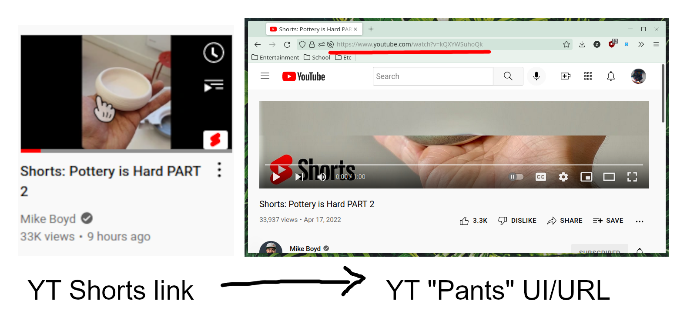

# yt-pants

Turn YouTube Shorts into pants

Uses a background script with an event listener on `tabs.onUpdated` to redirect
`https://youtube.com/shorts/X` to `https://youtube.com/watch?v=X`. When you
click on a link, the shorts page will momentarily appear and then be redirected
to the real youtube video.  Unfortunately it kind of breaks the back button. I
believe `webNavigation.onHistoryStateUpdated` might be able to help but I
really don't have the patience to implement that. PRs welcome if you figure it
out :)
